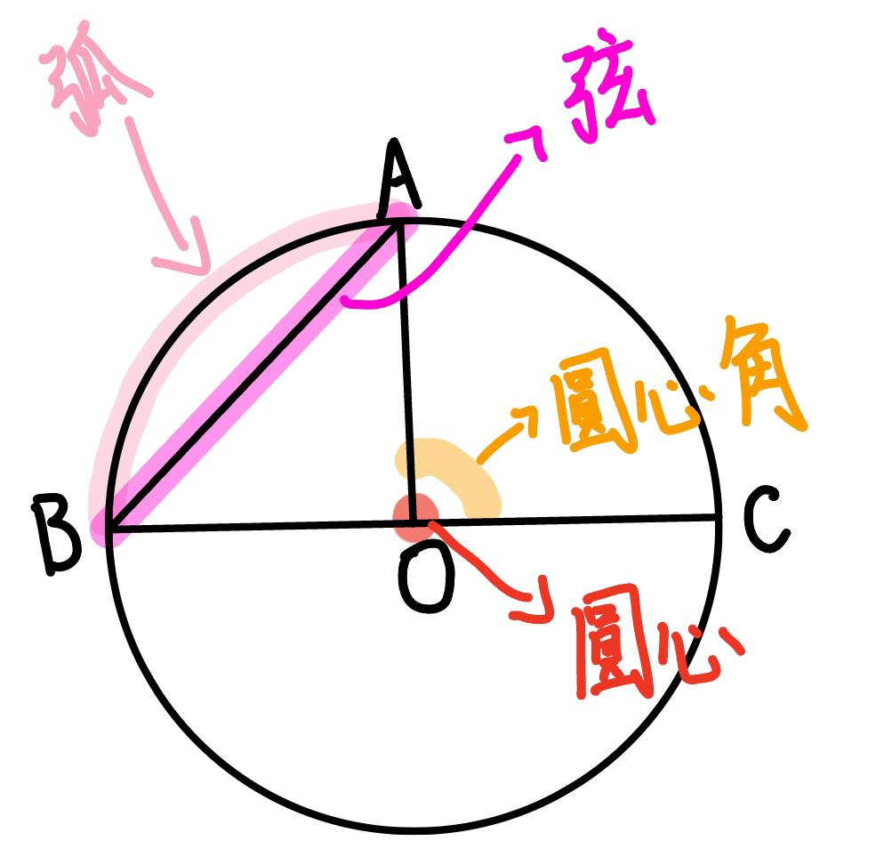

## 有理数
整数与分数统称为有理数

## 数轴
- 数轴：画一条水平直线，在直线上取一点表示0叫做**原点**，选取某一长度作为**单位长度**，规定直线上向右的方向为**正方向**，向左的方向为**负方向**。
- 任何一个有理数都可以用数轴上的一个点来表示。
- 数轴上两个点，右边总比左边大。
- 正数大于0，负数小于0，正数大于负数。

## 绝对值
- 在数轴上，如果两个数对应的点位于原点的两侧，且与原点的距离相同，那么称其中一个数为另一个数的**相反数**，也称这两个数互为相反数，**0的相反数是0**。
- 在数轴上，一个数所对应的点与原点的距离叫做这个数的**绝对值**，例如+2的绝对值等于2，-3的绝对值等于3
- 正数的绝对值是它**本身**；负数的绝对值是它的**相反数**；0的绝对值是0
- 两个负数比较大小，绝对值大的反而小

## 有理数的加法
- 加法交换律：a+b=b+a
- 加法结合律：a+(b+c)=(a+b)+c

## 有理数的乘法
- 乘法交换律：$a*b=b*a$
- 乘法结合律：(a\*b)\*c=a\*(b\*c)
- 乘法对加法的分配律：(a+b)\*c=a\*c+b\*c

## 有理数的除法
- 除以一个数等于乘这个数的倒数
$a\div b=a\times \frac {1}{b}$

## 平面图形
- 两点确定一条直线：经过两点有且只有一条直线
- 两点之间线段最短：两点之间的所有连线中，线段最短

## 等式的基本性质
- 等式的两边同时加上(或减去)同一个代数式，所得结果仍是等式。
- 等式两边同时乘一个数(或除以同一个**不为0**的数)，所得结果仍是等式。

## 打折销售
- $利润率=\frac {利润}{成本}=\frac {售价-成本}{成本}$

## 整式的乘除
- $a^m \cdot a^n=a^{m+n}$
- $(a^m)^n=a^{mn}$
- $(ab)^n=a^nb^n$
- $a^m \div a^n=a^{m-n}$
- $a^0=1 (a\neq 0)$
- $a^{-p}=\frac {1}{a^p}(a\neq 0)$

## 平方差公式
$(a+b)(a-b)=a^2-b^2$

## 完全平方公式
$(a \pm b)^2=a^2 \pm 2ab+b^2$

## 两条直线的位置关系
- 相交
    - 对顶角相等
    - 垂直
         - 平面内，过一点有且只有一条直线与已知直线垂直
        - 直线外一点与直线上各点连接的所有线段中，垂线段最短
- 平行
    - 过直线外一点有且只有一条直线与这条直线平行
    - 平行于同一条直线的两条直线平行
    - 同位角相等，两直线平行
    - 内错角相等，两直线平行
    - 同旁内角互补(180°)，两直线平行
    - 两直线平行，同位角相等
    - 两直线平行，内错角相等
    - 两直线平行，同旁内角互补
- 补角：两角和为180°
- 余角：两角和为90°

