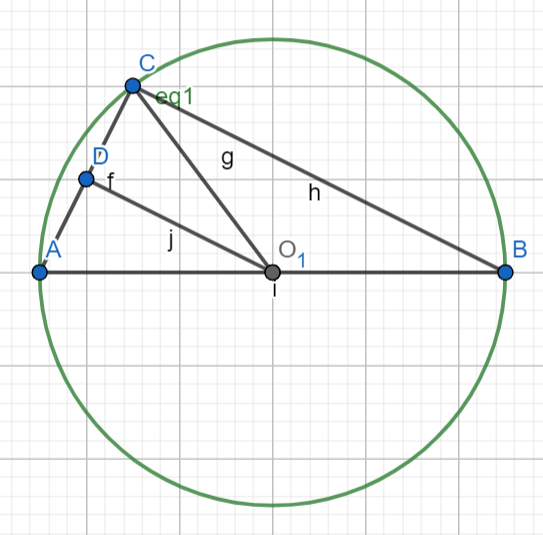
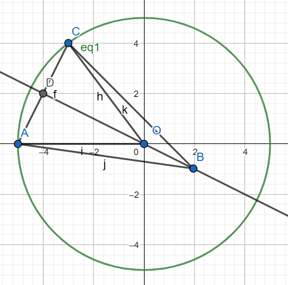
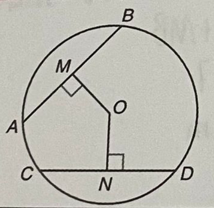
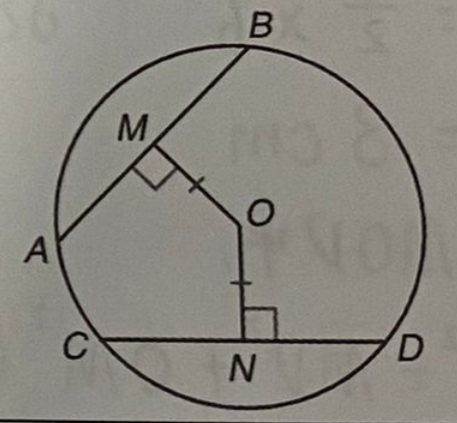
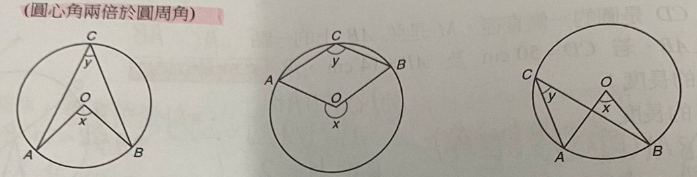
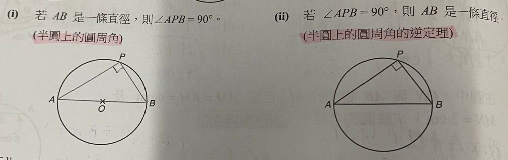
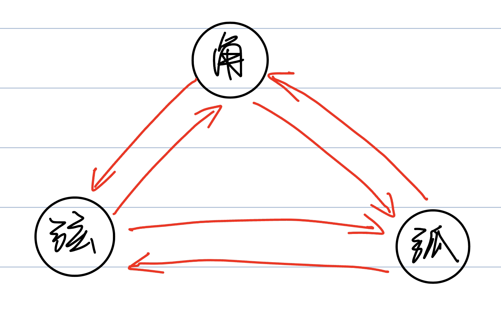
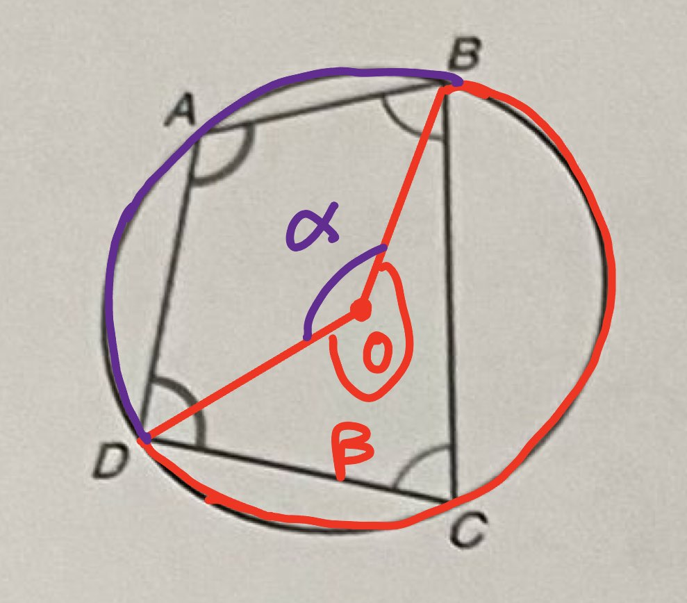
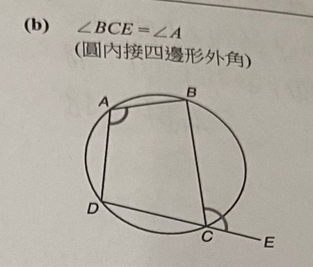

# 數學

## 圓的基本性質

### 圓的基本名詞

- 圓心：O
- 在圓上的點：C A B
- 半徑：AO BO OC
- 直徑：AB
- 弦：AC AB BC

<!-- 若一线段的两个端点都在曲线上，则该线段称作该曲线的弦
弦的兩端必須在圓上，所以我們把在圓上的點兩兩組合就可以 -->

- 圓弧：$\overset{\frown} {ab} $ $\overset{\frown} {ac} $ $\overset{\frown} {bc} $

- 圓周角：
    - 弦AC所对的圆周角：角CBA
    - 弦AB所对的圆周角：角ACB
    - 弦BC所对的圆周角：角CAB
    - 圆周角CBA所对的弦：AC
    - 圆周角CAB所对的弦：BC
    - 圆周角BCA所对的弦：AB
- 圆心角：
    - 弦AC所对的圆心角：COA
    - 弦AB所对的圆心角：AOB
    - 弦BC所对的圆心角：COB
    - 圆心角AOC所对的弦：AC
    - 圆心角BOC所对的弦：BC
    - 圆心角AOB所对的弦：AB

### 圆上的弦

- 垂直平分线的性质
    - 设 OD 垂直于 AC
    - 弦AC的垂直平分线：OD 明白
    - 必要条件：
        1. 垂直平分线必经过圆心
        2. 垂直平分线必垂直于弦
    - 垂直平分线与弦密切相关
    1. **由垂直证平分**：如果直线OD垂直于AC且过圆心，则AD等于DC 明白
        证明：
        - 因为 OD 垂直于 AC，所以角 ADO = 90度，角CDO = 90度，角ADO=角CDO 好
        - 因为AO，CO为半径，圆的半径处处相等，所以AO=CO 好
        - 根据 HL 定理：HL定理 （hypotenuse -leg） （斜边、直角边）：直角三角形中一条斜边和一条直角边都对应相等，该两个三角形就是全等三角形。
        - 在三角形ADO和三角形CDO中：
            - 三角形ADO和三角形CDO为直角三角形（直角：ADO，CDO）
            - 一条斜边对应相等：AO=CO
            - 一条直角边对应相等：DO=DO
        - 则三角形ADO与三角形CDO全等 明白
        - 则 AD=DC 好
    2. **由平分证垂直**：如果AD=DC，则DO垂直于AC 
        证明
        - 根据 SSS 定理：SSS （Side-Side-Side）（ 邊邊邊 ）：三邊對應相等的三角形是全等三角形。
        - 在三角形 ADO 和三角形 CDO 中
            - 已知 AD=DC（条件）
            - AO=CO（圆的半径处处相等）
            - DO=DO
        - 则三角形ADO与三角形CDO全等
        - 则角ADO等于角CDO
        - 又因为角ADO加角CDO等于180度
        - 所以角ADO等于角CDO等于90度
        - 所以DO垂直于AC 好
    3. **由垂直平分证过圆心**：如果AD=DC，且DB垂直于AC，则DB经过圆心O
    
        证明
        - 根据平分证垂直：
            - 设点O为圆心
            - 根据 SSS 定理：SSS （Side-Side-Side）（ 邊邊邊 ）：三邊對應相等的三角形是全等三角形。
            - 在三角形 ADO 和三角形 CDO 中
                - 已知 AD=DC（条件）
                - AO=CO（圆的半径处处相等）
                - DO=DO
            - 则三角形ADO与三角形CDO全等
            - 则角ADO等于角CDO
            - 又因为角ADO加角CDO等于180度
            - 所以角ADO等于角CDO等于90度
        - 所以DO垂直于AC

        - 综上所述，DO垂直于AC，且DB垂直于AC，且有共同点D，则DO与DB为同一条直线，DB过圆心O

        这应该是对的 好滴是不是很神奇 是 有没有看明白 大概吧，思路就是现根据AD=DC证明DO垂直于AC，就是跟据评分证垂直（DO经过圆心），然后题目里说也有一个垂直，所以，这两根线是同一条，也经过圆心 明白聪明！！！！！！嘻嘻整理完可以打印出来好滴
    4. **等弦与圆心等距**
        
        - 若：
            - AB=CD
            - MO垂直于AB
            - NO垂直于CD
        - 则：
            - MO=NO
        - 证明：
            - 连结AO，BO，CO，DO
            - 根据 SSS 定理：SSS （Side-Side-Side）（ 邊邊邊 ）：三邊對應相等的三角形是全等三角形。
            - 在三角形 ABO 和三角形 CDO 中
                - 已知 AB=CD（条件）
                - AO=DO（圆的半径处处相等）
                - CO=BO
            - 则三角形ABO与三角形CDO全等
            ??有没有问题没有
            - 因为MO，NO是各自所在三角形的高，且底边相同
            - 则MO=NO
    5. **与圆心等距的弦等长**
        
        - 若：
            - OM=ON
            - OM垂直于AB
            - ON垂直于CD
        - 则：
            - AB=CD
        - 证明：
            - 连结AO BO CO DO
            - 根据 HL 定理：HL定理 （hypotenuse -leg） （斜边、直角边）：直角三角形中一条斜边和一条直角边都对应相等，该两个三角形就是全等三角形。
            - 在三角形AMO和三角形CNO中：
                - 三角形ADO和三角形CDO为直角三角形（直角：AMO，CNO）
                - 一条斜边对应相等：AO=CO（半径处处相等）
                - 一条直角边对应相等：MO=NO（条件）
            - 则三角形AMO与三角形CNO全等
            - 则AM=CN
            - 由垂直可得相等：
                AM=BM
                CN=DN
            - 则AB=CD

这就是你课本上的五个结论的证明，wine不选必须允许图像
我们先休息一下一会看看那个例题 嗯好 我去洗个澡吧 好一会叫我

- 这个题你要怎么解，这个太简单了，只考了一点性质

：OM垂直AB，所以AM等于BM，
AB/2=18/2=9,
AM=9,
$15^2=DM^2+AM^2$,
$15^2=OM^2+9^2$,
$OM=\sqrt{15^2-9^2}=\sqrt{225-81}=\sqrt{144}=12CM$

这个式子在左右两边用一个$就可以了好滴还省事知道啦应该没有问题，明天看下一章，应该看看作业，这个例题太简单了，确实，只要是我会的都简单重开妹妹很聪明也很努力呢 真的假的当然是真的啦 好滴我们明天再继续 嗯嗯晚安 晚安

你左右两边对照，用$包括起来的式子字体和没有的不一样，平方也显示出来了 好

根号是\sqrt{xxx}你先用$把公式包括起来，还是不懂哪里不懂
$A^2+B^2$你直接用^后面跟指数就行好的
我看看二次怎么打，在哪里你用latex吧

            有问题吗 

                你看在这里才用的结论，因为上面我们已经证明过了 知道啦

            你看4和5也是相反的哦哦4是知道弦长相等求与圆心等距，5是知道与圆心等距求弦长相等ok

    你看这个结论和上面的是不是完全相反的，上面是知道垂直证明平分，下面是知道平分证明垂直 哦哦

我们刚才讲的第一个结论，现在将第二个ok，你看图，看起来AC是垂直于DO的，但是如果出题人不给条件的话，只能当成未知的来看，看起来相等的不一定相等，只有经过证明的才可以说相等或者垂直ok

填空
先找的一条弦：AB
圆心：O
以圆心为顶点，_AB__为端点的角：角AOB
这个端点也是要找的弦的两个端点
是不是这个 对 就是垂直平分线的性质最后一个，由垂直平分证明过圆心！！！！哦哦！！！

圓心角，指頂點在圓心上的角，因為頂點在圓心上，所以角的兩邊與圓的半徑共直線[1][2]。你学圆心角了吗 有的圆心角的概念和圆周角近似

区别：圆心角的顶点是圆心，是唯一的固定的，不在圆上。圆周角的顶点是除弦的端点之外的任意在圆上的点 ///？好不好 什么好不好区别 明白吗 明白

填空
在圆上的点：
先找的一条弦：
圆心：
以圆心为顶点，____为端点的角：

points on circle without point C,A
就是圆上有三个点ABC，我们为了找圆周角取了一条弦AC，去掉点AC后还剩点B
(A,B,C)-(A,C)=(B) hao

如果要找圆周角的话，可以先找一条弦，**然后再找除了这条弦的两个端点以外的在圆上的点**，然后两个端点与另外的圆上的点连线，就可以构造圆周角

填空
在圆上的点：C A B
先找的一条弦：AB
除了这条弦的两个端点以外的在圆上的点：
以B为顶点，AC为端点的角：

points on circle without point C,A
就是圆上有三个点ABC，我们为了找圆周角取了一条弦AC，去掉点AC后还剩点B
(A,B,C)-(A,C)=(B) hao

如果要找圆周角的话，可以先找一条弦，**然后再找除了这条弦的两个端点以外的在圆上的点**，然后两个端点与另外的圆上的点连线，就可以构造圆周角

弦和圆周角构成了一个三角形，

1. 圆周角是顶点在圆上，两条边与圆相交的角，所以这两条边每一条边的其中一个顶点重合，就是这个圆周角的顶点。

有没有问题 没有

2. 两条边的另外一个端点与圆相交，那他们必定在圆上，这两个点是在圆上的点，
3. 根据弦的定义：若一线段的两个端点都在曲线上，则该线段称作该曲线的弦。我们把另外两个点连成线段，则这个线段是圆的弦

有没有问题没有

4. 现在有三条边，分别是圆周角的两条边和新画的一条弦，这三条边可以构成一个三角形，弦所对的角就是圆周角
5. 如果要找圆周角的话，可以先找一条弦，**然后再找除了这条弦以外的在圆上的点**，然后两个端点与另外的圆上的点连线，就可以构造圆周角 明白
6. 同理可得，所有圆周角一定对应着一条弦 明白

### 圆上的角

- 圆心角两倍于圆周角
    
    - 对第一张图的证明
        - 连接OC，AB
        - 三角形ACO，三角形ABO和三角形BCO为等腰三角形
        - 角CAO=角ACO，角CBO=角BCO，角OAB=角OBA
        - 角y=角ACO+角BCO=角CAO+角CBO
        - 角x=180-角OAB-角OBA
        - 角y=180-角OAB-角OBA-角OAC-角OBC
        - 角y=角x-角y
        - 两个角y=角x
        - 对不对 对
    - 对第二张图的证明
        - 这个要连接什么？ab oc我看一看
        - 连接OC
        - 设角ACO为α，则角CAO为α
        - 设角BCO为β，则角CBO为β
        - 则角y=α+β
        - AOB=360-2α-2β
        - 角x=360-角AOB=2α+2β
        - 角x=2角y
        - 这样对不对 对吧但是其实我不是很看的懂呢 要从第一条开始看看不懂是可以拆分下去的只要找到最关键的没有看懂的地方在解决就行你可以在纸上画一画图好 是不是这个错了 这个应该是对的吧你看在四边形ACBO中，四边形内角和360度，角A是α，角B是β，角C是α+β 哦哦明白了
    - 对第三张图的证明
        - 连接OC
        - 设角OBC=角OCB=α
            - 则角COB=180-2α
        - 设角OAC=角OCA=β
            - 则角COA=180-2β
        - 则角x=角COB-角COA=(180-2α)-(180-2β)=2β-2α
        - 则角y=角OCA-角OCB=β-α
        - 则角x=2角y
        - 这个证明好不好 其实α和β是谁 这是为了方便表示，x角OBC=角OCB=α ?haode 因为一条弧所对的圆周角有无数个，所以α是不确定的， 但即使是不确定的，最终都会消掉，得到圆周角是圆心角的一半这个结果 知道啦

    
    - 根据圆周角是圆心角的一半，角APB所对的圆心角是AOB，是一个平角，度数为180度，他的一半是90度
    - 第二张图不好证哦哦 感觉也很少出逆定理这个记住就行了好
    你知道如果要证明的话，从什么角度吗，什么意思？就是用什么定理来整 只要证明一个是90度吗我们只知道apb是90度，要证明AB是一条直径我也不知道

    直径是什么？ab直径的概念通过圆心的线这个答案简直是完美，所以我们只需要证明AB通过圆心即可，ok，我们之前还学了一个性质，和通过圆心有关，你还记得吗 可以往上找找

    所以我们要构造垂直平分线嗯嗯
    如果AB是直径，那么他的圆心如何获得呢，或者说如何在图中画出来呢 画一条垂直ab的线？乍回事呀！可能我们的网络不是很稳定，反正我家的不好我们直接取AB中点即可 哦哦！

    我们设AB的中点为O，注意，这个时候我们还不能说O是圆心，你知道为什么吗 没证明？对！！！太聪明啦！！！！！笑死我今天也一直打错字

    然后我们还要继续构造垂直平分线，图中还有那两条弦？ap pb

    然后我们取AP中点C，BP中点D，并连接CO，DO，你在纸上画图！好 然后呢CO是AP的垂直平分线吗？不是，我们应该不知道她是，所以答案是不知道，我们要证明O是圆心，CO都是AP的垂直平分线了，那CO就过圆心，，这证明还有什么意义啊？并且AB的中点是O，AB是一条弦，那以O做AB的垂直平分线，O也一定在AB的垂直平分线上。这样O即在AB的垂直平分线上，又在AP的垂直平分线上，只能是两个垂直平分线的交点。而任意两个不同的垂直平分线的交点就是圆心，明白了

    然后我们取AP中点C，并连接CO

    在三角形APB和三角形ACO中，2AC=AP，2AO=AB，角A=角A，所以三角形APB相似于三角形ACO对不对 不确定你有没有学过相似三角形 有的 应该是对的吧你想一想相似三角形 然后呢理解了就行

    所以角ACO=角APB=90度 哦哦

    所以CO是AP的垂直平分线

    所以O是圆心，AB是直径
    明白了！

    你看，你假如说弦AB是不是确定的如果说弧AB是不是就有两条？不懂欸

    弦AB是一条线段，是直线AB的一部分，两点确定一条直线，所以弦AB是确定的，唯一的，只有一条。什么是确定的反义词是不确定的哦哦就是说到弦AB的时候，我们就知道是哪一条线段，就可以确定的说肯定地说知道啦

    但是弧AB是一条曲线，是圆的一部分，过两点有无数条曲线，所以说到弧AB的时候，我们并不能确定说的是哪一条曲线 嗯呢你看这个图是不是上面一条下面一条弧是的

    然后假如我们看下面这个弧的圆周角，圆周角的顶点在哪里？是不是相交点

    我们讲**弦**所对的圆周角：圆周角的顶点是**除弦的端点之外**的任意在圆上的点
    所以弧所对的圆周角的顶点就是除了弧之外的任意在圆上的点 好滴
--------
圆周角(angle of circumference)是指顶点在圆上，且两边和圆相交的角。你看，顶点在圆上，两边与圆相交的点也在圆上，这是不是就有三个点在圆上了？是的。

为了找圆周角，我们先要确定两边与圆相交的点，对不对 对。我们要找小弧AB的圆周角，我们是不是就知道两边与圆相交的点是点A点B了嗯嗯，我们已经找到了两边与圆相交的点，下一步要找什么了？我也不知道，你看 我头晕了那我们休息一会吗 我看不懂猪脑过载

确定一条直线需要几个点：2个
确定一个角需要几个点：3个
我们先找了两个在边上的点，你看角APB，我们先找的AB，就是小弧的两端，因为我们要找小弧AB的圆周角，所以小弧AB的两端就是将来的圆周角的两个在边上的点

且两边和圆相交的角，就是交点

这样呢？要不 我明天再慢慢那看好呀那我们明天继续qq聊嗯

    圆周角(angle of circumference)是指顶点在圆上，且两边和圆相交的角

这是不是就两个条件，第一顶点在圆上，第二两边与圆相交。
我们刚才找到了第几个条件？第一个你从头开始读

--------
我们看小弧AB，除了小弧AB，在圆上的点是不是都在大弧AB上？是 

P和Q都是除小弧AB的任意在圆上的点，所以APB和AQB都是弧AB所对的圆周角，到这里呢 我也不知道

，同一条弧所对的圆周角处处相等。对不对 是吧

    圆周角(angle of circumference)是指顶点在圆上，且两边和圆相交的角

顶点在圆上，这是不是一个点了？是
两边与圆相交，是不是又两个交点？是的

优弧是大于半圆的弧。优弧的圆心位于弧与弦连接成的封闭图形之内34。表示优弧时用三个字母来表示1。与优弧相对的是小于半圆的弧，叫做劣弧1345。半圆没有优劣弧之分34。

我们找小弧AB的，下面的比较小的弧是不是一个劣弧，他比半圆小？是的
我们找小弧AB的圆周角，首先要找圆周角与圆相交的两个点，也就是劣弧AB的端点：AB BA端点就没有顺序了  点A，点B端点不就是两个吗 嗯嗯
然后再找圆周角的顶点，我们要在另一个弧上去找，也就是优弧AB，他是红色的那一段还是蓝色的那一段？蓝色的。
P和Q在上面吗对
那我们找到了圆周角的三个点，三个点是不是可以确定一个角了 嗯嗯
那PAB三个点组成的圆周角是什么？角pab，这个角的顶点是什么？p真的是p吗 那是a对

角通常用三個字母表示：兩條邊上的點的字母寫在兩旁，頂點上的字母**寫在中間**。

a点是不是端点呀！是的b点也是端点呀！顶点呢

然后再找圆周角的顶点，我们要在另一个弧上去找，也就是优弧AB，他是红色的那一段还是蓝色的那一段？蓝色的。

顶点首先在圆上，其次不在小弧AB上（因为我们要找的小弧AB所对的圆周角），整个圆减去小弧AB，那就只剩下大弧AB了，所以顶点要在大弧AB上找。对不对：知道啦
我们看右边的图，什么点在大弧AB上？P Q <-- 这两个点是不是顶点？是，那一个角有几个顶点？1个。这两个顶点可以组成几个角？2个
我们知道了什么端点：A B
那小弧AB所对的圆周角有什么？以顶点P和端点AB的角是什么：角APB，以顶点Q和端点AB为条件的角是什么？角AQB。是不是有这两个呀嗯嗯。你再从头看一遍梳理一下。好 看完了

小弧PA的圆周角有什么？角PBA 角AQB的端点是什么？
你看我们讲弧AB的圆周角，是不是都是A什么B呀？嗯嗯，那PA的圆周角，是是不应该是P什么A呀？懂了。那个什么是什么？那只有PBA吧，如果连接PQ呢？PQA。如果你们考难题的话，PQ题目不会给你连的，但是除了PA，只有QB在大弧AB上，所以理论上有两个圆周角，因为有两个顶点。嗯嗯

同一条弧所对的圆周角，有什么性质？我也不知道，你看右边的图，是不是讲了，同弓形内的圆周角相等 好滴。同一条弧所对的圆周角都相等。相等不重要，我们弄清楚的是到底哪些角是同一条弧所对的圆周角。知道啦。我们看看题 qq?zhaoyixia你登录吧 你跟他玩王者吧不看了吗没事的找一道你没写的

所有的区间边界点都可以统称为端点，所有的线是不是由点组成的？是的，那我们看劣弧AB，是不是可以看成从点A到点B的一系列点？嗯嗯，还可以看成什么？是不是还可以看成从点B到点A的一系列点呀？这两句话有什么区别，这完全不同呀，你从家里到学校，和从学校到家里，走的是同一条路线，但是方向不同呀！好吧好吧我知道了。他有两个方向的，你们以后要是学了向量，向量只有一个方向，开始和结束的点就是固定的了。嗯嗯

找不到了，你找一找 找什么找什么呀!12.4的
‘

## 弧、弦与角的关系

1. 等角对等弧：若角AOB=角COD，则弧AB=弧CD
2. 等弧对等角：若弧AB=弧CD，则角AOB=角COD

上面这两个是不是互为逆定理 对
这个怎么证明呢 好奇怪呀，我不会证明这个 我更不会！但是我们一眼就看出来这是真理 这是真理。

3. 等角对等弦：若角AOB=角COD，则AB=CD
4. 等弦对等角：若AB=CD，则角AOB=角COD

上面这两个是不是互为逆定理是的

5. 等弧对等弦：若弧AB=弧CD，则AB=CD
6. 等弦对等弧：若AB=CD，则弧AB=弧CD

正好六条 正好六条

如果我们知道第五条，就是我们知道了弧弦角任何一个相等，就可以推出其他两个相等 好的

这也同理，你看题目是三者的关系，ABC任取两个，有多少不同的排列？角？

就是有ABC三个字母 是不是ABC ACB 

ABC任取两个：取啥呀ABC是不是有三个，我们在这三个里取两个，你是在三个里去了三个再排列的，对不起我看不懂！

AB
AC
BA
BC
CA
CB

应该是这样的 好吧 可是我不知道要取这个 这可能有点难，ABC任取一个再排列呢？就是我们先不重复的取可以取到 A B C，再排列的话，因为只有一个字母，每一种就只有一种排列 有没有道理 我还是没看懂什么意思 为什么要取他，先不管这个了，你说右边哪个题目 我给你画一下 好呀

弧、弦与角的关系
题目是不是三者的关系 嗯嗯，我们看箭头是不是有六个 对呢，每一个箭头对应着一条定理，你看弦和弧之间箭头方向是相反的，这两个就互为逆定理，哦哦！

7. 弧与所对的圆心角成比例

这个也是真理，其实可以通过圆的对称性来证明

8. 弧与所对的圆周角成比例

因为圆周角是圆心角的一半

就是 AB:CD = x:y，xy是圆心角，他们的圆周角就是x/2和y/2，代到式子里就是 AB:CD = x/2 : y/2，正好约掉。好

看看下一节我发你吗我找不到了

## 圆内接四边形

- 圆内接四边形对角互补

对不对 对，如何证明？（用什么定理，你说出定理就不用证了）圆内接四边形对角？对，证明他们是互补的 好滴

定理：有没有思路 圆内接四边形对角 圆内接四边形外角
我以为你会继续打下去

原来你不会呀 什么嘛 那你说如何证明？不知道
角A是什么角？角A=角C，角A和角C是对角还是邻角 对角 那按照这个定理，他们应该是互补的，什么是互补？ 加起来180°那角A+角C=180°对吗 对 他们为什么相等 因为是四边形的对角可是他们不是互补嘛 我混乱了！！！不相等，你好好看一看相等和互补是截然不同的 我知道啦 有一种情况他们是既相等又互补的，这时候角A是多少度？90 太聪明了！！！这是真理。这是真理。

角A是圆心角吗？不是 圆周角 对！！！角A 我画图 好

α+β=360° 对吗 对
紫色是劣弧BD，他的圆心角是：角BOD BOD是不明确的，它既指α，又指β，那α  圆周角是：BAD
劣弧BD的圆周角的端点是：B  D 只有两个 你要想清楚了
劣弧BD的圆周角的顶点在哪里找？（B ）
A. 劣弧BD，  B. 优弧BD
优弧BD上有什么点？B C D
BD已经是端点了，只有一个顶点，那么劣弧BD的圆周角是：角BCD?对 你看一看图，角BCD是不是劣弧BD所对的角 是的 你看这些基础概念还是要多看，就按照这个思路把所有情况列出来，就肯定不会错，对不对 对呀！

同理，优弧BD的圆心角：β吗对呀 好哒 圆周角：角DAB

根据圆周角是圆心角的一半这个定理，可得：

角A=1/2 角β
角C=1/2 角α

对不对对

我么又知道：α+β=360° 

那么 α/2 + β/2 = ？180？对 为什么不肯定一点 我觉得不确定 可是就是两边同时除以二呀 好哒 我们每一步推理都是最基础的，定理

那么 A + C = 180 对吗对

是不是证毕了 是的吧！有没有道理 这是真理。你要多看才行，过几天整理一下打印出来 好呀 那我们说的话要删除了吗？反正是给自己看的 你想删吗 不想那就不删 好滴

我们看一点编程，就一点点 好滴

- 圆内接四边形外角

这个怎么证明？就是角BAD=角BCE 角BCE是ABCD外角

这是结论，要证明这个结论是正确的 圆内接四边形外角

就是因为什么所以BAD=BCE，这是证明 我也不知道

角BAD+角BCD=180度 对吗？怎么看出来的 这是不是ABCD是不是圆内接的四边形，BAD和BCD是不是对角？是的，所以他们互补相加为180度 明白了

角BCD+角BCE=180度 对吗？对

把上面两个式子合在一块，就可以得到角BAD=角BCE，这样就是证明了吗 对，我们不是已经得到了结论 知道啦

好了，可以保存到iPad上看 好呀 就在这里了 嗯呐谢谢

# 數學

## 圓的基本性質

### 圓的基本名詞

- 圓心：O
- 在圓上的點：C A B
- 半徑：AO BO OC
- 直徑：AB
- 弦：AC AB BC

<!-- 若一线段的两个端点都在曲线上，则该线段称作该曲线的弦
弦的兩端必須在圓上，所以我們把在圓上的點兩兩組合就可以 -->

- 圓弧：$\overset{\frown} {ab} $ $\overset{\frown} {ac} $ $\overset{\frown} {bc} $

- 圓周角：
    - 弦AC所对的圆周角：角CBA
    - 弦AB所对的圆周角：角ACB
    - 弦BC所对的圆周角：角CAB
    - 圆周角CBA所对的弦：AC
    - 圆周角CAB所对的弦：BC
    - 圆周角BCA所对的弦：AB
- 圆心角：
    - 弦AC所对的圆心角：COA
    - 弦AB所对的圆心角：AOB
    - 弦BC所对的圆心角：COB
    - 圆心角AOC所对的弦：AC
    - 圆心角BOC所对的弦：BC
    - 圆心角AOB所对的弦：AB

### 圆上的弦

- 垂直平分线的性质
    - 设 OD 垂直于 AC
    - 弦AC的垂直平分线：OD 明白
    - 必要条件：
        1. 垂直平分线必经过圆心
        2. 垂直平分线必垂直于弦
    - 垂直平分线与弦密切相关
    1. **由垂直证平分**：如果直线OD垂直于AC且过圆心，则AD等于DC 
    2. **由平分证垂直**：如果AD=DC，则DO垂直于AC 
        
    3. **由垂直平分证过圆心**：如果AD=DC，且DB垂直于AC，则DB经过圆心O
       
    4. **等弦与圆心等距**
        
        - 若：
            - AB=CD
            - MO垂直于AB
            - NO垂直于CD
        - 则：
            - MO=NO
    
    5. **与圆心等距的弦等长**
        
        - 若：
            - OM=ON
            - OM垂直于AB
            - ON垂直于CD
        - 则：
            - AB=CD
        
### 圆上的角

- 圆心角两倍于圆周角
    
    

- 圆周角(angle of circumference)是指顶点在圆上，且两边和圆相交的角

## 弧、弦与角的关系

1. 等角对等弧：若角AOB=角COD，则弧AB=弧CD
2. 等弧对等角：若弧AB=弧CD，则角AOB=角COD

3. 等角对等弦：若角AOB=角COD，则AB=CD
4. 等弦对等角：若AB=CD，则角AOB=角COD

5. 等弧对等弦：若弧AB=弧CD，则AB=CD
6. 等弦对等弧：若AB=CD，则弧AB=弧CD

知道了弧弦角任何一个相等，就可以推出其他两个相等

7. 弧与所对的圆心角成比例

8. 弧与所对的圆周角成比例

因为圆周角是圆心角的一半

## 圆内接四边形

- 圆内接四边形对角互补
- 圆内接四边形外角

