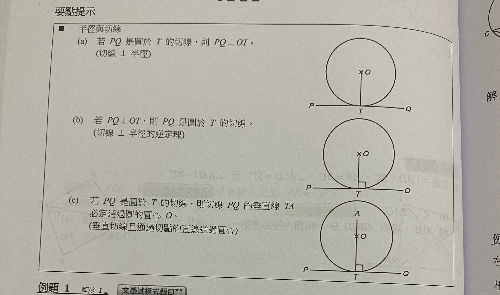
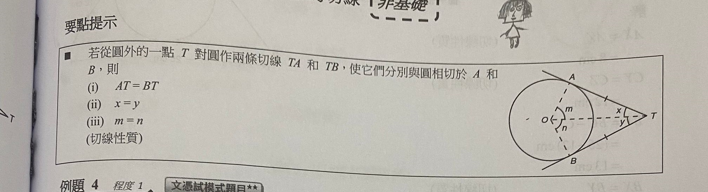
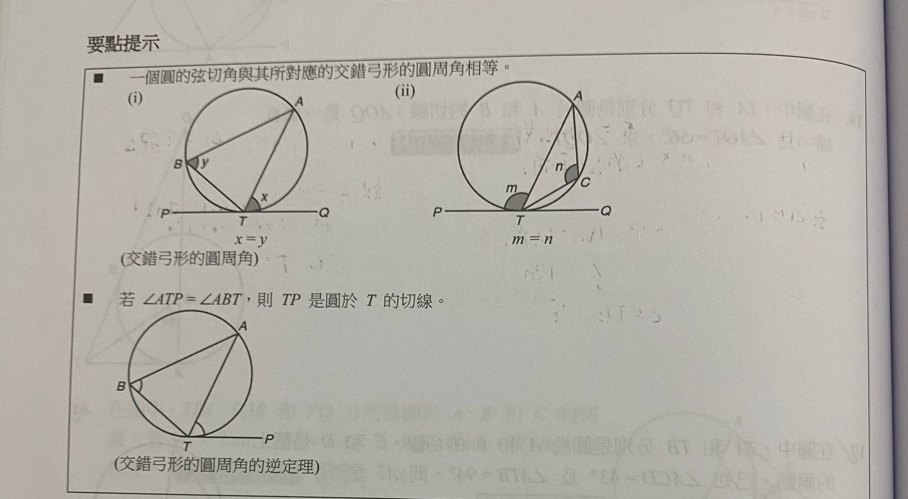

## 圆的切线及其性质

a. **【切线垂直于半径】** 若 PQ 是圆于 T 的切线，则 PQ 垂直于 OT

1. OA 大于 OB  直线与圆相交  直线与圆有2个交点
2. OA 等于 OB  直线与圆相切  直线（切线）与圆有1个交点（切点）
    - 这种情况是最特殊的，其他两个情况都有无数种画法，但是OA=OB只有一种画法 好哒
    - 这种情况时，直线被称为切线，交点被称为切点 明白了
    - 和圆相交的线、和圆不相交的线有无数个，和圆相切的线只有一条（这是建立在垂直于同一条半径的基础上，就是我们昨天画过图，当线段垂直于OA的时候，和圆相交的线、和圆不相交的线有无数个，和圆相切的线只有一条 好哒
3. OA 小于 OB  直线与圆相离  直线与圆有0个交点

T 是什么？切点
PQ 是什么？切线
你在想怎么狡辩，我没有 这可是刚学的 哪里错，了 你拖到了一个过圆心的直线呀，不是圆的切线，和圆有两个交点。并且你说切线和圆也有两个交点，明明是一个！我知道了不要生气 没有生气呀 你重新拖一下

为什么说切线垂直于半径？

首先，半径是圆上一点到圆心的距离
其次，切线到圆心的距离就是切点到圆心的距离
切点是圆上的点，所以切线到圆心的距离就是半径
切线到圆心的距离必定是垂直于切线的
所以切线垂直于半径

对不对 对

不知道怎么说

切线只是一个特殊的直线，十三种情况中的一个。。半径是什么？概念：是不是圆上一点到圆心的距离？睡着了 胃好痛 要吃饭呀耳鸣了不知道什么是 那你躺一会一会打字我就看到了

这样是对的，你刚才怎么想的 不知道

b. 【切线垂直于半径的逆定理】若 PQ 垂直于 OT，则 PQ 是圆关于 T 的切线

这个逆定理是如何判断切线和作图的依据，
哪一条直线是圆的切线？我描出来 我的加载好慢。。 你说左边的还是右边 的 右边 为什么 因为垂直于半径 左边应该不是垂直吧 线段 LM 也垂直于半径，他是切线吗 他不是 所以你的理由不充分，少了什么条件？我也不知道了 垂直于半径的同时，是不是还要过半径在圆上的端点呀 对 这个端点是什么？T 他同时是什么点PQ的中点？我们不知道pq具体位置，只知道pq在直线上，T还是切点 好哒

关于 T 的切线 讲切线也要讲切点，一个切点对应几条切线？我记得 无数个 不对 一个切点只对应一条切线 好吧！那你在第二幅图画出切点T的第二条切线？已经画了吧！哪一条 这是第一条呀 还有的吗  一个切点只对应一条切线 所以切点T只对应切线PQ呀 你怎么说无数个 哈哈哈好尴尬呀

那一条切线在一个圆上有几个切点？这下是无数个了吧 那你说PQ在圆O上的切点都有什么 我觉得我又说错了 我看看你怎么理解的呀才知道 你看看都有什么 应该就T 那你之前怎么说无数个 你要想好了再说 因为我昨天有印象 什么是无数个的  要思考之后再说 我每次都想很久 可能是想的太少了没有逻辑思维

T是什么？切线 可是t只是一个点 to是 to是什么？切线 to是不是圆的半径呀？是呀圆的半径为什么是切线 中间分开了呀 不对 好吧

切线首先是一条直线 对不对 对哒 其次，切线为什么叫“切”呢 我也不知道

假设平面上有一条直线和一个圆，那他们有几个交点？一个 拿出你的iPad 好哒 下载 Microsoft whiteboard在下了

OB 是不是还可以看成直线CD到圆心的距离？对
 我不小心点到了 好哒 
OA 是什么？半径
OA 和 OB 是不是代表着一个数字？ 为什么代表数字 圆的半径和点到直线的距离都是有实际数值的 哦哦
两个数字之间有什么关系？我也不知道 如果他们比较的话？ob比oa数字大 这是一个还有呢 都是一条线上的？数字之间的关系 我们先不看具体的图，就假设有两个数字，这两个数字之间有可能有什么关系？没有听明白 两个数字比较 是不是有 大于 等于 和小于关系呀 对呀
所以OA和OB也有大于等于和小于关系 原来如此呀 我们画了一种情况，属于哪一种关系？大于和小于 两个数字可以同时大于和小于吗 讲大于关系要把谁大于谁讲清楚好哒 还有两种关系是什么写出来

1.ob大于oa 
2.oa小于ob
还有？还有等于呀 看着不像等于 我们先不看那个图
3.oa=ob
1和2是不是重复的 没有把 ob>oa 是不是 oa<ob haoxiangshiye 仔细看一看改一下 好 怎么不动了 你问的只是oa和ob的关系吗 对呀

我们不是首先说OA和OB有大于等于和小于的关系？嗯嗯
然后说画的图的关系是OB大于OA？对
然后我们 还有两种关系是什么写出来 是不是 大于等于和小于的关系 除了大于之外的另外两种关系？OA大于AB OB=OA+AB

OA和OB之间就这三种关系，把中间的词替换一下不就行了？是我想的太复杂了不好意思！没有复杂的东西，我们都是从最简单的开始推的 好哒

你把这三种情况画出来，已经画了一种了，你擦掉写的字在旁边继续画

你看一看这三幅图，然后记住，和下面这三个关系 喵喵喵 好了吗 什么呀 记住了吗 三个关系所对应的图现在记住了
这三个关系对应了直线与圆的三个关系，这个也要记一下 嗯嗯 很好理解，就是字面意思 好哒 记住了吗 记住了 你们有没有讲过这个？没有 那可能教的不好 我们老师很急着快点教完，她觉得 来不及 可是这些是最基础的概念，可能你忘了吧 也有可能

1. OA 大于 OB  直线与圆相交  直线与圆有2个交点
2. OA 等于 OB  直线与圆相切  直线（切线）与圆有1个交点（切点）
    - 这种情况是最特殊的，其他两个情况都有无数种画法，但是OA=OB只有一种画法 好哒
    - 这种情况时，直线被称为切线，交点被称为切点 明白了
3. OA 小于 OB  直线与圆相离  直线与圆有0个交点

c. **【垂直切线且通过切点的直线通过圆心】** 若PQ是圆关于T的切线，则切线PQ的垂线TA必定通过圆心 O。

这个圆有两条切线对吗 对呀 你画一下关于切点的垂线 关于？就是于吧我看你们的定理 好 是这样吗？对但是不够长

这两个直线有一个交点 这个点是什么 圆心点 对 真聪明 谢谢

你过点A作关于圆O的切线 哪一条是切线？右边竖的 对应的切点是什么？A 切点是不是应该在圆上啊

我觉得是紫色的那一条 好像你的更对

还能再画一条吗？好像可以把 那你画 好哒

OE垂直于EA
OB垂直于BA

AC和AD不是切线，因为OCA和ODA不是直角，他们和圆也有两个交点
你画的是一条和圆不相交的线 好吧！

我们看有两个三角形对不对 对 这两个三角形全等，因为

HL：
OA=OA
OB=OE
角OBA=角OEA

对不对 对

既然三角形全等，那么对应的边和角也相等：

AB=AE
角BAO=角EAO
角BOA=角EOA

对不对 对哒

弦切角 在幾何學中，弦切角（英語：chord tangent angle ) 是指頂點在圓上，且其中一邊與圓相交，且另一邊與圓相切的角。即經過圓上某一點的弦與經過同一點的切線所成的角。

你先画出这个圆的一条弦 是不是这样呀 这是一条弦，不过是一条特殊的弦，因为他是圆内最长的弦，也就是直径，一般我们画图不画特殊的情况，因为数学定理是普遍适用的。好哒 你画一个不特殊的 

 然后把它们连起来 是这样吗 对，这就是一条弦 好哒

 然后这个弦是不是有两个端点？嗯嗯 你把其中一个端点作为切点画圆的切线 是不是出现了两个角？是的 我们一般看小于九十度的角

 弦切角 在幾何學中，弦切角（英語：chord tangent angle ) 是指頂點在圓上，且其中一邊與圓相交，且另一邊與圓相切的角。即經過圓上某一點的弦與經過同一點的切線所成的角。

 这两个角都是弦切角，我们看小于九十度的角，它所对的是哪一条弧？

 然后你再画一下这个弧的圆周角，对了，一个弧的圆心角有几个？一个吧 圆周角呢？我也不知道 我都不知道怎么画 你不是画了吗 圆周角 之前讲过 你都忘了 呜呜呜呜 对不起

那要我怎么办 什么怎么办呀 你都不知道圆周角

点A和点B之间有几条线？一条 为什么我看到三条 明白了

这三条线分别是弦AB，优弧AB，劣弧AB
我们看比较小的弧，就是你用黄色画出来的
如果要找他的圆周角
对了，你画一下他的圆心角 
如果要找他的圆周角，我们需要在另一个比较大的弧AB上任取一点，然后把这个点作为顶点，分别连接这个点与AB 对不对 这句啥意思 就是先让这个点与A相连，再让这个点与B相连 好哒

你现在另一个比较大的弧AB上任取一点，给他一个名字
那ACB是不是弧的圆周角 是的啦
C点的位置有无数个，所以AB所对的圆周角也有无数个 好哒

这个13.3 第一个定理就是，这个圆周角和弦切角相等嗯嗯

哪两个相等？角ACB和角ABD
你看关键是不是弦AB？ 嗯嗯